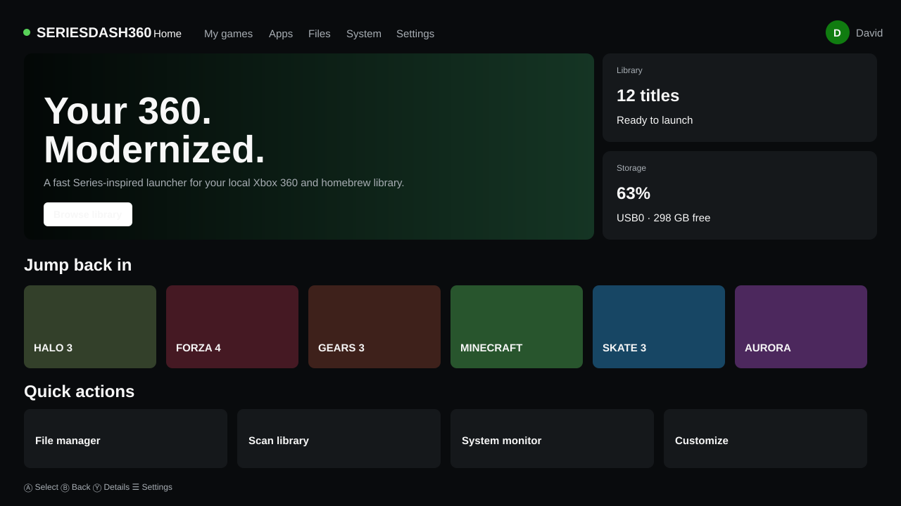
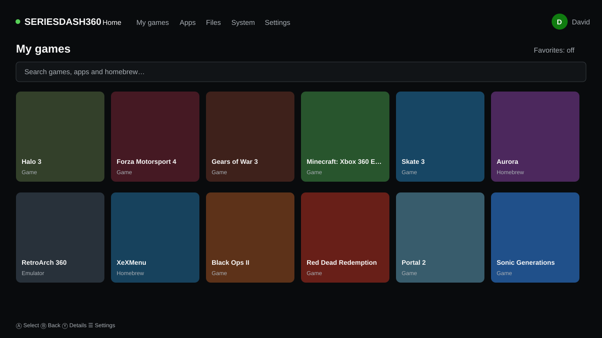
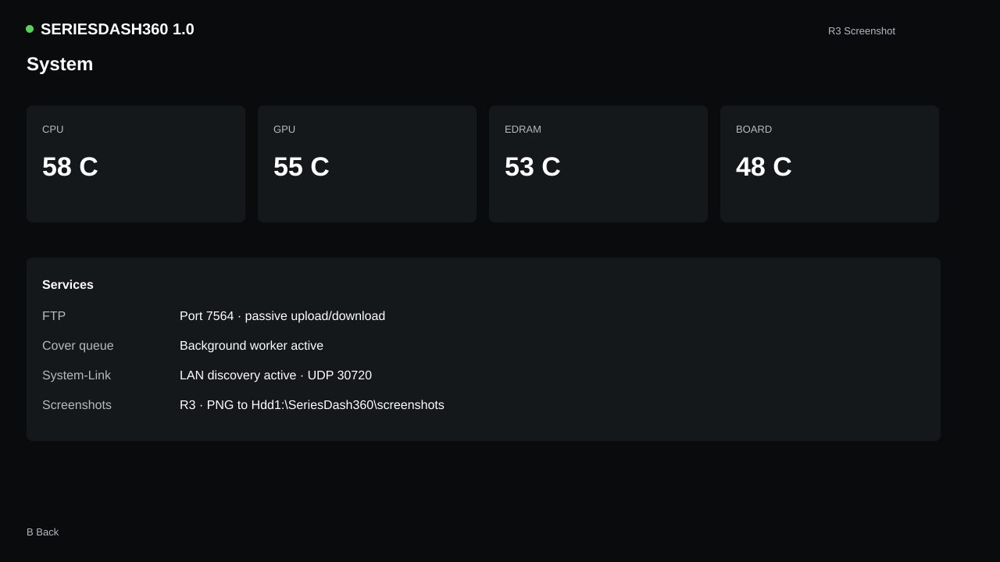

# SeriesDash360

> A modern Xbox Series-inspired dashboard/front-end project for Xbox 360 homebrew environments.



SeriesDash360 is an **unofficial community project** that aims to bring a clean, fast, controller-first interface to Xbox 360 homebrew setups. The design takes inspiration from the current Xbox Series family while the feature roadmap focuses on the practical library-management ideas people expect from dashboards such as Aurora.

**Current version:** `0.1.0` — early development preview.

## Highlights

- Xbox Series-inspired Home experience
- Cover-driven game and app library
- Search, favorites and recent titles
- Automatic recursive scanning for `default.xex`, `default.elf` and `default.xbe`
- Local cover discovery (`cover.png`, `cover.jpg`, `icon.png`, `folder.jpg`)
- Basic automatic categories for games, homebrew, emulators and apps
- File-manager core: list, copy, move, delete and create folders
- INI settings and theme-ready architecture
- System-information API for temperatures, storage and network data
- Platform abstraction separating desktop development from Xbox 360 bindings
- Interactive browser preview for rapid UI iteration

## Screenshots

### Home


### My games


### System


## Project status

| Area | Status |
|---|---|
| Portable C++17 core | ✅ Working |
| Desktop/library scanner | ✅ Working |
| Series-style browser preview | ✅ Working |
| Favorites/search/recent model | ✅ Working |
| File-manager core | ✅ Working |
| Native Xbox 360 renderer | 🚧 Planned / port work |
| Xbox 360 controller backend | 🚧 Planned / port work |
| Native system telemetry | 🚧 Planned / port work |
| Host launch adapter | 🚧 Planned / port work |
| FTP / metadata services | 🚧 Planned |
| Plugin/script API | 🧭 Roadmap |

See [`docs/FEATURE_MATRIX.md`](docs/FEATURE_MATRIX.md) for the detailed matrix.

## Try the interactive preview

On Windows, run:

```bat
OPEN_PREVIEW.bat
```

Or open `preview/index.html` in a modern browser.

The browser build is a **design/development preview**, not an Xbox 360 executable. It persists favorites using `localStorage` and lets the UI be iterated without deploying to a console for every change.

## Desktop core build

```bash
cmake -S . -B build -DCMAKE_BUILD_TYPE=Release
cmake --build build --config Release
./build/seriesdash360 config/seriesdash.ini
```

On Windows you can also use `BUILD_WINDOWS.bat` from a Visual Studio/CMake developer environment.

## Xbox 360 target

The portable code is under `include/sd360` and `src`. Xbox-specific work lives behind the platform adapter in `platform/xbox360`.

SeriesDash360 intentionally keeps exploit/patching responsibilities outside the dashboard. The console must already be running a compatible homebrew-capable environment. The adapter is intended to provide storage roots, controller input, rendering, system stats and a launch request through APIs available in that host environment.

Read [`docs/XBOX360_PORT.md`](docs/XBOX360_PORT.md) before attempting a console port.

## Safety / scope

This repository does **not** include exploit code, signature patches, DRM bypasses, hypervisor/kernel patches, Xbox Live bypasses, or piracy-oriented DLC/title-update logic. It is a dashboard/front-end project for locally available content and homebrew-capable environments.

## Repository layout

```text
SeriesDash360/
├─ assets/screenshots/       # README / project screenshots
├─ config/                   # Default settings
├─ docs/                     # Port plan and feature matrix
├─ include/sd360/            # Portable public interfaces
├─ platform/desktop/         # Desktop development adapter
├─ platform/xbox360/         # Xbox 360 adapter skeleton
├─ preview/                  # Interactive Series-inspired UI preview
├─ src/                      # Portable C++ core
├─ CMakeLists.txt
└─ README.md
```

## Roadmap

The long-term goal is an Xbox 360 dashboard with a modern Series-style UX and a strong set of everyday homebrew-dashboard features: cover library, richer metadata, categories, storage management, system telemetry, themes, screenshots, network services and a controlled extension API.

## Disclaimer

SeriesDash360 is not affiliated with, endorsed by, or sponsored by Microsoft, Xbox, Team Phoenix/Aurora, or any console manufacturer or dashboard project. Xbox and related marks are property of their respective owners.
